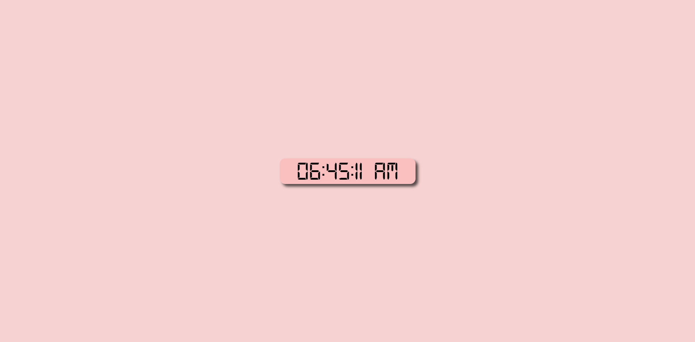

# 🕒 Digital Clock

A digital clock built with HTML, CSS, and JavaScript.

## 🌟 Features

- Real-time display: Updates every second to show the current time.

## Screenshots

## Tech Stack

HTML, CSS, JavaScript

## Live Link

[Digital clock live link](https://abdur-rahman-apu.github.io/Digital-Clock-JS/)
